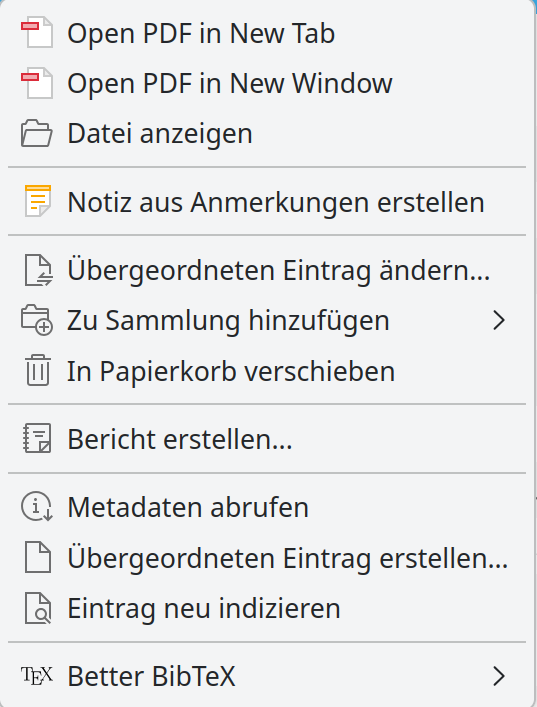
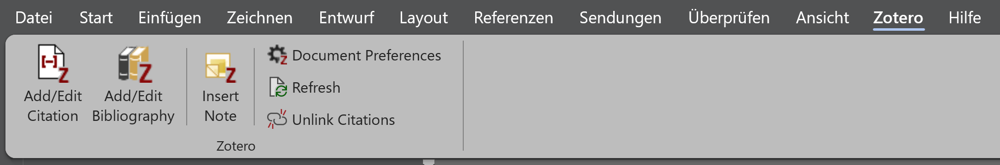
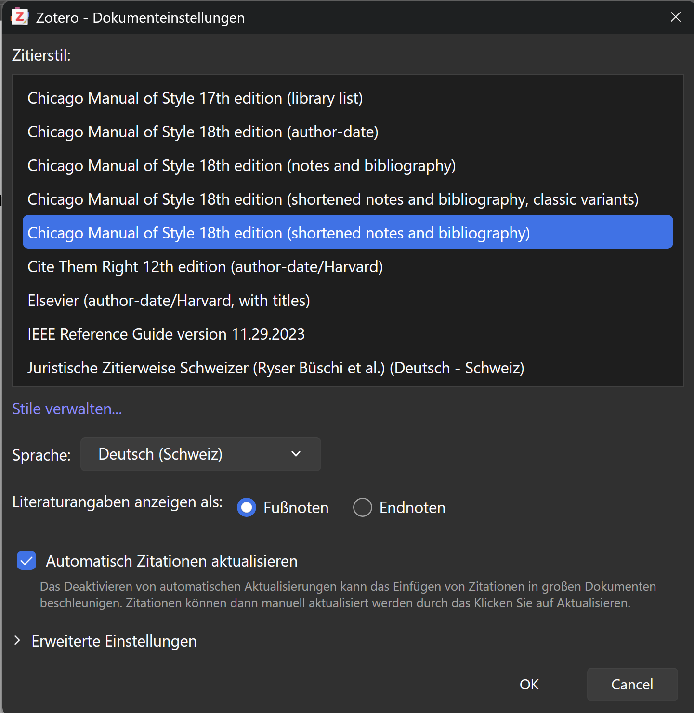
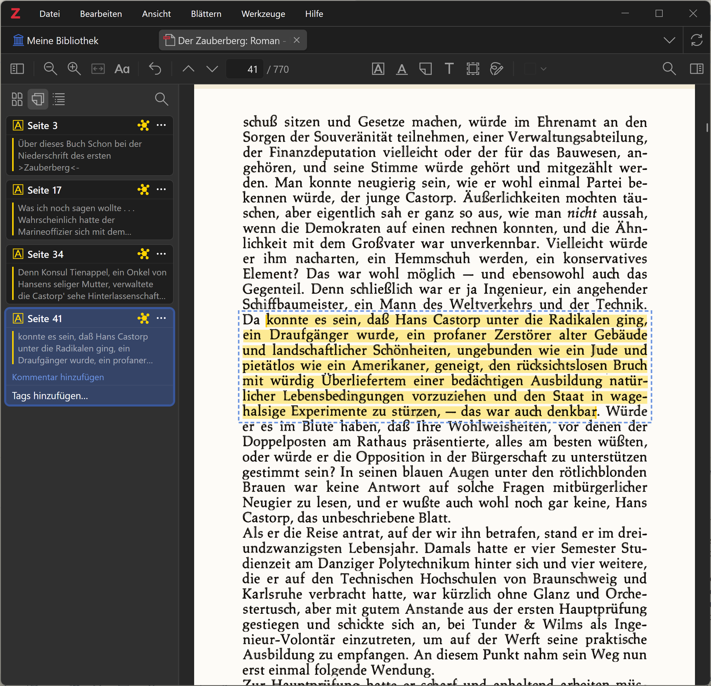

[Zotero](https://www.zotero.org/) bewirbt sich selber als persönlicher
Forschungsassistent. Im 
gymnasialen Umfeld ist Zotero in erster Linie ein Hilfsmittel, Zitate in
Texten korrekt zu formatieren. Darüber hinaus kann Zotero auch als
E-Reader mit Zusatzfunktionen zur Verwaltung von Notizen verwendet
werden. 

Diese Anleitung zeigt für Zotero 9 Schritt für Schritt, wie

* Zotero installiert wird;
* Einträge in die Zotero Bibliothek gemacht werden können;
* Referenzen in einen Text aufgenommen werden, sowie
* Zotero als Wissensdatenbank verwendet werden kann.

## Zotero installieren und einrichten

Um die Funktionen von Zotero im vollen Umfang zu nutzen, ist es sinnvoll,
einen Zotero-Account zu erstellen. Der Account kann auf der Website von
[Zotero](https://www.zotero.org/user/register) erstellt werden. Wenn der
Account nicht ausschliesslich privat genutzt werden soll, ist es
sinnvoll, die Schul- bzw.\ Geschäftsemail zu verwenden. Im Nutzerprofil
können auch mehrere Adressen hinterlegt werden. Das ermöglicht es, die
eigene Datenbank zu behalten, wenn man eine Institution verlässt.

Nachdem optional ein persönlicher Account erstellt worden ist, kann der
[Zotero Desktop Client](https://www.zotero.org/download/)
heruntergeladen und installiert werden. Auf der gleichen Seite findet
sich auch die Möglichkeit, den Zotero-Connector als Browser Plugin
herunterzuladen. Dieses Plugin ist für die Arbeit mit Zotero nicht
zwingend erforderlich, vereinfacht aber die Erfassung von Quellen
ungemein.

Wenn Zotero installiert ist, kann auf Windows Rechnern über den Menüpunkt 'Bearbeiten >
Einstellungen', Registerkarte Sync die Synchronisation mit dem eigenen Zotero-Account
eingerichtet werden. Auf Mac Rechnern finden sich die Einstellungen
unter dem Menü 'Zotero > Einstellungen'.

## Einträge in Zotero erstellen und organisieren

Es gibt verschiedene Methoden, wie Einträge in die Zotero Bibliothek
aufgenommen werden können. Hier werden die gängigen Methoden Schritt für
Schritt mit Beispielen erklärt.

* Eintrag mit dem Zotero-Connector erfassen.
  
  Damit Einträge mit dem Zotero-Connector erfasst werden können, muss
  neben dem Browser auch die Zotero-Desktop-Applikation geöffnet sein.
  Gearbeitet wird bei (im Hintergrund) geöffneter
  Zotero-Desktop-Applikation im Browser. 

  Nach der Installation des Zotero-Connectors für den verwendeten
  Browser muss dieser via Plugin Manager (in den meisten Browser ein
  Icon, das wie ein Puzzle Teil aussieht {height="1em"}) an die Menüzeile angepinnt
  werden. Durch das Anpinnen erscheint in der Menüzeile ein neues Symbol
  in Form eines grauen Buchstabens 'Z'.

  Für das Beispiel soll der [Wikipedia Artikel zu
  Zotero](https://de.wikipedia.org/wiki/Zotero) erfasst werden. Dazu
  muss die [Website](https://de.wikipedia.org/wiki/Zotero) geöffnet
  werden. Wenn die Website offen ist, kann das graue 'Z' Symbol
  angeklickt werden. Beim erstmaligen Anklicken erscheint ein
  Hinweisfenster. Dieses kann angenommen werden. Anschliessend öffnet
  sich oben rechts im Browser ein Pop-Up Fenster, das einem mitteilt,
  dass die Website nach Zotero gespeichert wird und dass ein Snapshot
  der Website angelegt wird. Ausserdem hat das Symbol für den Zotero
  Connector eine neue Darstellung erhalten. Neu sieht es wie ein
  aufgeschlagenes Buch aus. So zeigt der Zotero-Connector an, als welche
  Kategorie der Eintrag angelegt wird. Im Fall Wikipedia ist das ein
  Enzyklopädieartikel. Der Zotero-Connector erkennt mehr oder weniger
  zuverlässig, um was für eine Kategorie von Eintrag es sich handelt. Der Eintrag
  muss aber in jedem Fall kontrolliert und gegebenenfalls manuell ergänzt und
  korrigiert werden.

  Ebenfalls über den Zotero-Connector können bibliographische Angaben
  aus Bibliothekskatalogen übernommen werden. Als Beispiel dient hier ein
  Eintrag im swisscovery Katalog zu 
  [Le rouge et le
  noir](https://swisscovery.slsp.ch/discovery/fulldisplay?docid=alma991171274013205501&context=L&vid=41SLSP_NETWORK:VU1_UNION&lang=de&search_scope=DN_and_CI&adaptor=Local%20Search%20Engine&isFrbr=true&tab=41SLSP_NETWORK&query=any,contains,le%20rouge%20et%20le%20noir&sortby=date_d&facet=frbrgroupid,include,9034117119244122733&offset=0).
  Wenn dieser Eintrag aufgerufen wird, nimmt der Zotero-Connector die
  Form eines Buches an. Dieser Eintrag wird als Buch angelegt,
  allerdings ohne Snapshot. Der Zotero-Connector erkennt korrekt, dass
  die Website von swisscovery ausschliesslich die Metadaten zum Buch zur
  Verfügung stellt.

  Andere Websites funktionieren analog zu diesen beiden Beispielen.

* Eintrag mittels eines Identifikators erfassen.
  
  In der Zotero-Desktop-Applikation können Einträge mittels der ISBN,
  DOI und ähnlicher Identifikatoren erfasst werden. Dazu ist das
  Zauberstab Icon über der Liste mit den Einträgen anzuklicken. Im sich
  öffnenden Fenster kann die ISBN eingegeben werden. Zotero sucht mit
  der ISBN online nach Einträgen mit der entsprechenden ISBN in
  Bibliothekskatalogen.  
  Als Beispiel dient hier die ISBN 9783110466201, Ovid, Niklas Holzberg (Hrsg.),
  Metamorphosen lateinisch-deutsch. Sammlung Tusculum. De Gruyter, 2017.

  Auch die via ISBN erfassten Einträge müssen unbedingt auf
  Vollständigkeit und Korrektheit kontrolliert werden.

* Hinzufügen von Büchern im Volltext
  
  Gewisse Verlage stellen Bücher auch im Volltext zum Download zur
  Verfügung. Solche Bücher können entweder direkt über die Website via
  Zotero Connector hinzugefügt werden oder heruntergeladen und
  anschliessend mit dem Menü 'Anhang hinzufügen'
  ({height="1em"}) in Zotero übernommen
  werden. Abhängig von den in der Datei zur Verfügung stehenden
  Metadaten, wird der übergeordnete Eintrag automatisch erstellt oder
  muss manuell erstellt werden. Falls der Eintrag nicht genügend
  Metadaten zur Verfügung stellt, muss der übergeordnete Eintrag mit
  Rechtsklick auf das eingefügte PDF manuell erstellt werden. Der
  entsprechende Dialog sieht folgendermassen aus:

  

  In diesem Dialog ist der Eintrag 'Übergeordneter Eintrag erstellen...'
  auszuwählen. Im sich öffnenden Dialog ist anschliessend 'Manueller
  Eintrag' auszuwählen. Nach diesem Arbeitsschritt können alle
  erforderlichen Angaben manuell erfasst werden.

  Wie das genau funktioniert, kann am Beispiel Chan, Tsz Nam, und
  Dingming Wu. Mastering the Academic Writing Mindset: A Guide to
  Crafting Computer Science Papers. Springer Nature Singapore, 2026.
  [https://doi.org/10.1007/978-981-95-4850-7](https://doi.org/10.1007/978-981-95-4850-7)
  ausprobiert werden. 

* Manueller Eintrag.
  
  Es besteht auch die Möglichkeit, Einträge komplett manuell zu
  erfassen. Dazu ist das Icon links neben dem Zauberstab (leeres Blatt
  mit kleinem Plus Symbol) zu verwenden. Wenn dieses Icon angeklickt
  wird, öffnet sich ein Auswahlmenü mit allen Eintragsarten, welche von
  Zotero zur Verfügung gestellt werden. Sobald eine Wahl getroffen
  worden ist, wird ein leerer Eintrag in der gewählten Kategorie
  angelegt. Die entsprechenden Metadaten können nun von Hand eingegeben
  werden. 

Eine ausführliche Anleitung, wie Einträge in Zotero erfasst werden, wird
auf der [Website von
Zotero](https://www.zotero.org/support/adding_items_to_zotero) zur
Verfügung gestellt. 

Für die Organisation der Bibliothek stellt Zotero zwei Möglichkeiten zur
Verfügung. Die Einträge können in Sammlungen organisiert werden oder
mit Tags versehen werden. Beide Möglichkeiten können parallel verwendet
werden.

Zotero Sammlungen werden mit einem ähnlichen Icon dargestellt wie
Windows Ordner. Dies darf aber nicht über einen grundsätzlichen
Unterschied hinwegtäuschen. Während Dateien in Windows Ordnern
ausschliesslich in einem Ordner gespeichert sind, stellen Zotero
Sammlungen keine Speicherorte dar. Das heisst, Zotero Einträge können in
mehreren Sammlungen gleichzeitig zusammengefasst werden. Dies ermöglicht
es beispielsweise, einen Eintrag gleichzeitig einer Sammlung 'Barock' und
'Lyrik' zuzuweisen.

Neue Sammlungen oder Untersammlungen werden durch einen Rechtsklick auf
'Meine Sammlung' oder eine bereits bestehende Sammlung angelegt. Im sich
öffnenden Kontextmenü kann dann der Eintrag 'Neue Sammlung' bzw. 'Neue
Untersammlung' ausgewählt werden.

Um einen Eintrag mit einem Tag zu versehen, muss dieser in der
Bibliothek ausgewählt werden. Ganz am rechten Rand erscheint dann eine
Auswahl mit mehreren farbigen Icons. Um einen Tag zu vergeben, ist das
Icon, welches wie eine Gepäcketikette aussieht, auszuwählen.

Eine ausführliche Beschreibung für die 
[Organisation](https://www.zotero.org/support/collections_and_tags)
einer Zotero Bibliothek findet sich ebenfalls auf der Website von
Zotero. 

## Einfügen von Referenzen in Texten

In dieser Anleitung wird beschrieben, wie Referenzen in ein Word
Dokument eingefügt werden.

Mit der Installation der Zotero-Desktop-Applikation sollte parallel das
Microsoft Word Add-In installiert worden sein. Dieses stellt in
Microsoft Word einen neuen Menüeintrag 'Zotero' zur Verfügung. Falls
dieser Menüpunkt in Word fehlt, kann das Microsoft Word Add-In manuell
installiert werden. Dazu sind die Zotero Einstellungen zu öffnen
(Bearbeiten -> Einstellungen). Im Einstellungsfenster ist der Tab
'Zitieren' auszuwählen. Ganz unten in diesem Tab findet sich ein Button
'Microsoft Word Add-In installieren'. Durch Anklicken dieses Buttons
wird das fehlende Add-In installiert. Allenfalls muss Word neu gestartet
werden. 

Das Zotero Word Add-In stellt in Word die folgenden Funktionen zur
Verfügung: 

Die einzelnen Funktionen werden hier der Reihe nach erklärt.

* Add/Edit Citation.
  
  Mit dieser Funktion wird eine Referenz im Text eingefügt. Bei der
  ersten Referenz in einem neuen Text muss vor dem Einfügen der Referenz
  zusätzlich noch der Zitierstil ausgewählt werden.

  

  Hier im Beispiel wird der Stil 'Chicago Manual of Style 18th edition
  (shortened notes and bibliography)' ausgewählt. Die Wahl des Stils ist
  an dieser Stelle allerdings nicht entscheidend, der Stil kann auch zu
  einem späteren Zeitpunkt noch geändert werden. Durch die Bestätigung
  des gewählten Zitierstils gelangt man zur Auswahl der zu zitierenden
  Referenz. 

  

  In dieser Dialogbox kann neben dem roten 'Z' nach einer Referenz in
  der Zotero Bibliothek gesucht werden. Gesucht werden kann nach Text in
  allen Feldern der Metadaten.

  

   Durch Anklicken des gewünschten Eintrags wird dieser in Form einer
   ovalen Textblase in die Suchzeile übernommen.

   
   
   Durch das Anklicken der Textblase kann die Referenz präzisiert
   werden.
   
   

   Die Details können durch das Drücken der Entertaste bestätigt werden.
   Dadurch wird der gewählte Eintrag aus Zotero als Referenz in der
   gewählten Darstellungsform in den Text übernommen.

   Falls die Referenz fehlerhaft erfasst wurde, kann sie angepasst
   werden. Dazu muss zuerst der in Word generierte Referenztext
   ausgewählt und dann nochmals das Icon 'Add/Edit Citation'
   angeklickt werden. Dies öffnet den Auswahldialog mit getroffener
   Auswahl. 

   Es können bei der Auswahl auch mehrere Referenzen gleichzeitig
   ausgewählt werden.

* 'Add/Edit Bibliography'.
  
  Durch Klicken dieses Buttons wird an der Stelle, an der sich der
  Cursor im Word Dokument befindet, ein Literaturverzeichnis eingefügt.

* 'Insert Note'.
  
  In Zotero können Notizen angelegt werden (vgl. @sec-notizen). Mit
  'Insert Note' kann nach Notizen gesucht und diese in den Text
  eingefügt werden. 

* 'Document Preferences'
  
  Hier können im Nachhinein andere Zitierstile ausgewählt werden.

* 'Refresh'
  
  Grundsätzlich werden Änderungen von Einträgen in Zotero im Dokument
  automatisch angepasst. Die 'Refresh' Funktion erzwingt in jedem Fall,
  dass die Einträge aus Zotero neu geladen werden. Es handelt sich also
  um eine Art Abkürzung oder vielleicht auch eine Vergewisserung, dass
  die Einträge aktualisiert werden.

  Weil Änderungen in Zotero Einträgen grundsätzlich automatisch ins
  Dokument übernommen werden, sollen Referenzen nicht im Dokument selber
  angepasst werden.

* 'Unlink Citations'
  
  Mit dieser Funktion kann die Verbindung zwischen Dokument und Zotero
  Datenbank unterbrochen werden. Aktualisierungen von Einträgen in
  Zotero werden dann nicht mehr in den Text übernommen.

## Zotero als Wissensdatenbank {#sec-notizen}

Zotero kann auch als E-Reader verwendet werden. Damit löst Zotero das
Versprechen ein, ein persönlicher Forschungsassistent zu sein. Welche
Unterstützung Zotero damit bietet, wird hier erläutert.

Beim Erfassen von Websites mit Hilfe des Zotero-Connectors wurden, wie
im Beispiel gezeigt, nicht nur die Metadaten erfasst, sondern auch ein
Snapshot der Website gespeichert. Der Inhalt der Referenz kann nicht
nur für Websites, sondern grundsätzlich für alle Eintragsarten
gespeichert werden.

So kann ein Eintrag zu einem Buch um ein PDF des Buches ergänzt werden.
Dieses PDF kann dann im PDF Reader von Zotero angezeigt werden. Der
Zotero PDF Reader stellt dann Werkzeuge zur Verfügung, um Anstreichungen
im Text vorzunehmen und diese mit Kommentaren zu versehen.

Die Anstreichungen und Kommentare werden dann als separate Notizen
gespeichert. 
Ausserdem können auch eigenständige Notizen angelegt werden. Dazu können
am rechten Rand der Zotero-Desktop-Applikation die Metadaten des
Eintrags angezeigt werden.

 

Mit dem Plus bei Notizen kann eine neue Notiz angelegt werden.

Die so erstellten Notizen können dann mit der Funktion
'Insert Note' in den Text übernommen werden.

Eine ausführliche Anleitung zu allen Funktionen findet sich in der
[Zotero Dokumentation](https://www.zotero.org/support/). 

  
